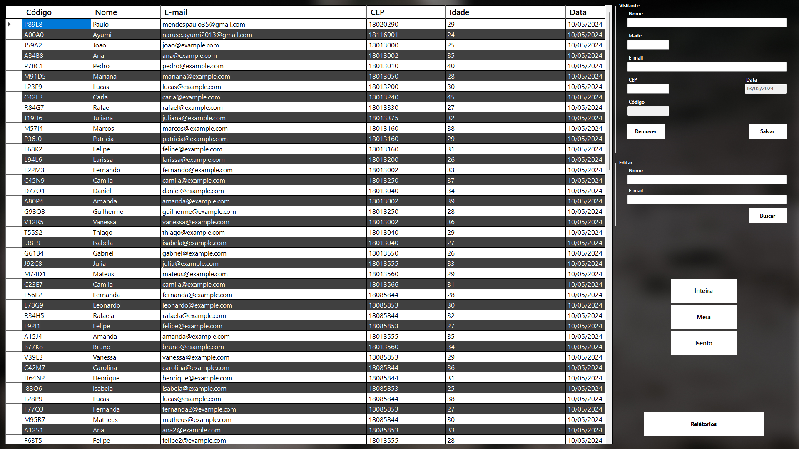
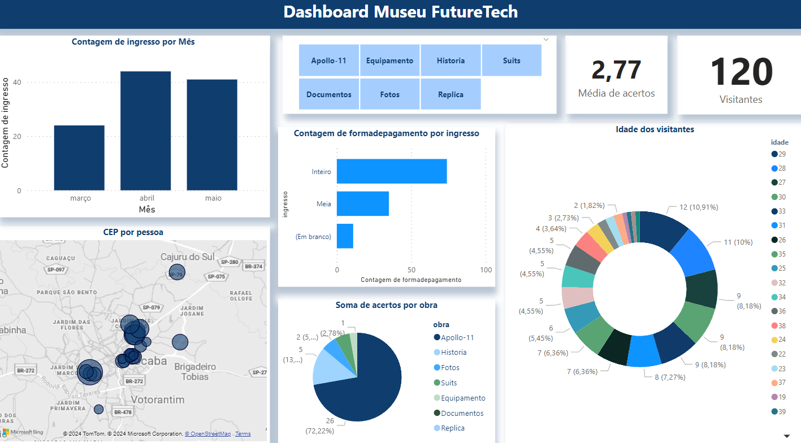

# Programa de Administração do Museu da Primeira Viagem à Lua 📋

Este programa é responsável por administrar o conteúdo e as operações do Museu da Primeira Viagem à Lua. Através deste programa, os administradores podem gerenciar as obras em exposição, visualizar dados da pesquisa de avaliação e realizar outras tarefas relacionadas à administração do museu.

Para realizar esse projeto, foi necessário a criação de 4 programas que iriam fazer a interação da experiência com o usuário com o museu. Segue abaixo o repositório dos outros 3 programas:

-[Programa Principal 🏛️](https://github.com/Paulopaiv/PIM-III-QUESTIONARIO)

-[Programa de Avaliação 📊 ](https://github.com/Paulopaiv/PIM-III-ADS-VISITANTE) 

-[Programa de Vendas 🛒 ](https://github.com/Paulopaiv/PIM-III-ADS-VENDAS) 

## Funcionalidades Principais ⚙️

- Gerenciamento das obras em exposição.
- Visualização dos resultados da pesquisa de avaliação.
- Administração de usuários e permissões de acesso.

## Tecnologias Utilizadas 🛠

- Plataforma: .NET
- Linguagem: C#
- Framework: Windows Forms

## Tabela de Dados dos Visitantes 📊

O programa de administração do Museu da Primeira Viagem à Lua possui uma tabela que exibe os dados dos visitantes, permitindo aos administradores visualizarem informações relevantes sobre as visitas ao museu. Além disso, o programa conta com um botão "Relatório" que oferece acesso direto ao Power BI, onde é possível visualizar um dashboard completo com análises detalhadas dos dados.

### Botão "Relatório" e Dashboard no Power BI

Ao clicar no botão "Relatório", o programa redireciona os usuários para o Power BI, uma ferramenta de análise de dados poderosa. Lá, os administradores podem acessar um dashboard interativo com gráficos, tabelas e métricas sobre os dados dos visitantes, permitindo uma análise mais aprofundada e auxiliando na tomada de decisões estratégicas para o museu.

  
  

Este recurso oferece uma visão abrangente e dinâmica dos dados dos visitantes, possibilitando uma melhor compreensão do perfil e comportamento dos visitantes, bem como o desempenho geral do museu.

## ✒️ *Autores*

- [Ayumi Muraki](https://github.com/AyuMuraki)
- [Lucas](https://github.com/LucasCerione)
- [Nicolas Onishi](https://github.com/NicolasKonishi)
- [Paulo Paiva](https://github.com/Paulopaiv)

## Como contribuir 💪

Se você deseja contribuir para este projeto, siga as etapas abaixo:

1. Faça um fork deste repositório.
2. Crie um branch: `git checkout -b <nome_branch>`.
3. Faça suas alterações e confirme-as: `git commit -m '<mensagem_commit>'`
4. Envie para o branch original: `git push origin <nome_do_projeto> / <local>`
5. Criar a solicitação de pull.

Caso tenha alguma dúvida, consulte a documentação do GitHub sobre [como criar uma solicitação de pull](https://help.github.com/en/github/collaborating-with-issues-and-pull-requests/creating-a-pull-request).

## ⏭️ Próximos passos

ntegração com Mídias Sociais: Integrar o programa com as redes sociais do museu para facilitar o compartilhamento de informações e eventos;
Acesso Remoto: Desenvolver uma versão web do programa para permitir o acesso remoto e a administração do museu de qualquer lugar.
